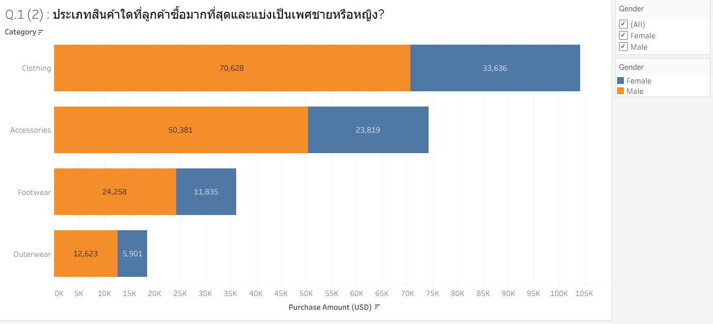
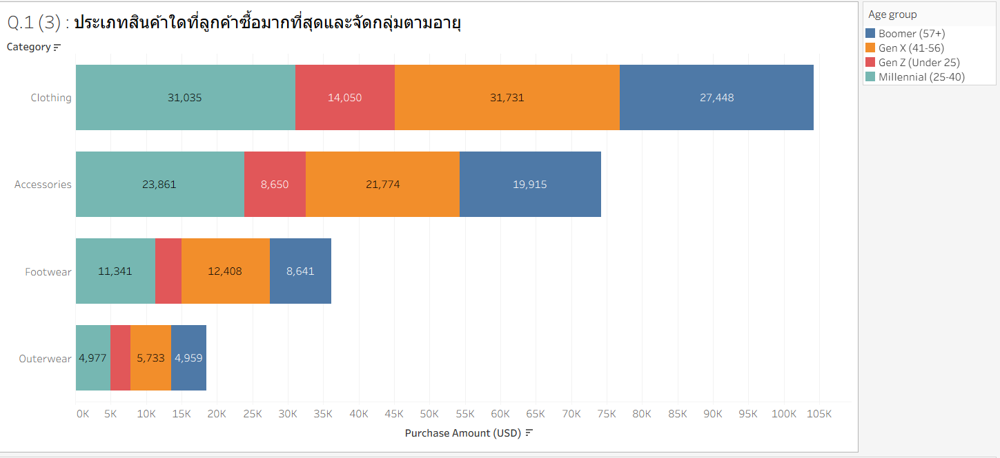
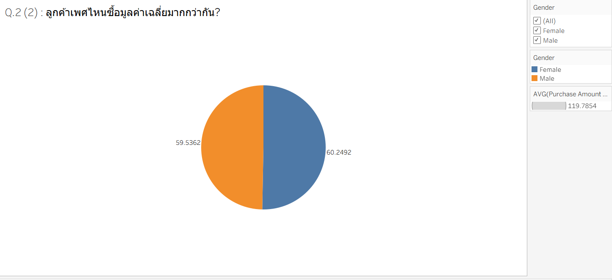
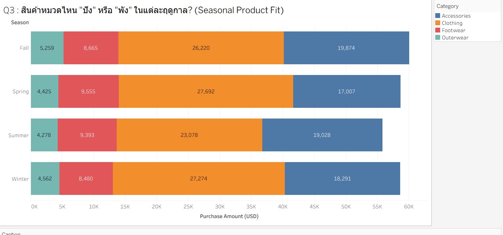
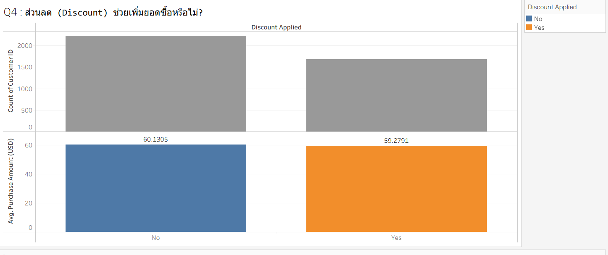
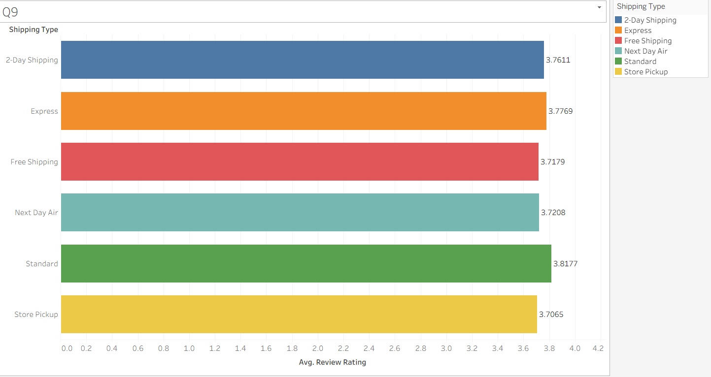

# 🛍️ Shopping Behavior Analysis 

**รายวิชา:** DS512/DS513 Data Analytics และ DS514/DS515 Data Science
---
---

## 📌 Executive Summary
โครงการนี้มีวัตถุประสงค์เพื่อวิเคราะห์ข้อมูลพฤติกรรมการซื้อสินค้า (Shopping Behavior) ของลูกค้าจำนวน 3,900 ราย เพื่อแก้ปัญหาประสิทธิภาพของการทำการตลาดแบบหว่านแห (Mass Marketing) โดยใช้กระบวนการทาง Data Science ตั้งแต่การทำ EDA, การทดสอบสมมติฐานทางสถิติเพื่อเพิ่มยอดขายและประสิทธิภาพแคมเปญการตลาด

---

## 📊 Business Problem & Objectives (ที่มาและปัญหา)

### 🔴 ปัญหา (Pain Points)
1.  **Discount Paradox:** การแจกส่วนลด (Discount) แบบเดิม ไม่ช่วยให้ลูกค้าซื้อสินค้าต่อบิลเยอะขึ้น 
2.  **Untargeted Marketing:** การทำการตลาดแบบหว่านแหทำให้สิ้นเปลืองงบประมาณโดยไม่จำเป็น

## 🎯 วัตถุประสงค์ (Objectives)

### 1. เพื่อศึกษาและวิเคราะห์ปัจจัย (To Analyze)
ศึกษาความสัมพันธ์ระหว่าง **ข้อมูลประชากร** (เช่น อายุ, เพศ) และ **ข้อมูลพฤติกรรม** (เช่น การใช้ส่วนลด, ความถี่ในการซื้อ) ที่ส่งผลโดยตรงต่อยอดขายและสถานะความเป็นสมาชิกของลูกค้า

### 2. เพื่อตรวจสอบสมมติฐานทางธุรกิจ (To Validate Hypotheses)
ทำการพิสูจน์ความเชื่อเดิมทางธุรกิจเกี่ยวกับประสิทธิภาพของ **"การแจกส่วนลด (Discount)"**  โดยใช้การทดสอบทางสถิติ (Hypothesis Testing) เพื่อยืนยันว่าปัจจัยเหล่านี้ช่วยกระตุ้นยอดซื้อต่อบิลได้จริงหรือไม่

### 3. เพื่อเสนอแนะแนวทางกลยุทธ์ (To Recommend)
นำผลลัพธ์ที่ได้จากการวิเคราะห์ทั้งหมด มาสังเคราะห์เป็นข้อเสนอแนะเชิงกลยุทธ์สำหรับการปรับปรุงรูปแบบโปรโมชั่น และการบริหารความสัมพันธ์ลูกค้า (CRM)

---

## 📂 Data Overview
* **Dataset:** `Shopping_behavior_updated.csv`
* **Records:** 3,900 แถว (Transaction Level)
* **Key Features:**
    * `Customer ID`, `Age`, `Gender`, `Location`
    * `Subscription Status`, `Payment Method`
    * `Purchase Amount (USD)`, `Discount Applied`
    * `Previous Purchases`, `Review Rating`

# 📘 Data Dictionary: Shopping Behavior

| ชื่อคอลัมน์ (Column Name) | ความหมาย (Description) | ชนิดข้อมูล (Data Type) | ตัวอย่างข้อมูล (Example) |
| :--- | :--- | :--- | :--- |
| **Customer ID** | รหัสระบุตัวตนของลูกค้า (ไม่ซ้ำกัน) | Integer | 1, 2, 3894 |
| **Age** | อายุของลูกค้า | Integer | 19, 45, 63 |
| **Gender** | เพศของลูกค้า | String (Categorical) | Male, Female |
| **Item Purchased** | ชื่อสินค้าที่ลูกค้าซื้อ | String | Blouse, Sweater, Jeans |
| **Category** | หมวดหมู่หลักของสินค้า | String (Categorical) | Clothing, Footwear |
| **Purchase Amount (USD)** | ยอดเงินที่ซื้อสินค้า (ดอลลาร์สหรัฐ) | Integer/Numeric | 53, 64, 90 |
| **Location** | สถานที่อยู่ของลูกค้า (รัฐ/เมือง) | String | Kentucky, Maine |
| **Size** | ขนาดของสินค้า | String (Ordinal) | S, M, L, XL |
| **Color** | สีของสินค้า | String | Gray, Maroon, White |
| **Season** | ฤดูกาลที่ทำการซื้อขาย | String (Categorical) | Winter, Spring, Summer |
| **Review Rating** | คะแนนรีวิวที่ลูกค้าให้ (เต็ม 5) | Float | 3.1, 4.7, 2.9 |
| **Subscription Status** | สถานะการสมัครสมาชิกของลูกค้า | String (Boolean) | Yes, No |
| **Shipping Type** | ประเภทการจัดส่งสินค้า | String (Categorical) | Express, Free Shipping |
| **Discount Applied** | มีการใช้ส่วนลดในการซื้อหรือไม่ | String (Boolean) | Yes, No |
| **Promo Code Used** | มีการใช้รหัสโปรโมชั่นหรือไม่ | String (Boolean) | Yes, No |
| **Previous Purchases** | จำนวนครั้งที่เคยซื้อสินค้ามาก่อนหน้า | Integer | 14, 2, 49 |
| **Payment Method** | วิธีการชำระเงิน | String (Categorical) | Venmo, Cash, Credit Card |
| **Frequency of Purchases** | ความถี่ในการซื้อสินค้าของลูกค้า | String (Categorical) | Weekly, Annually |

## 🧹 Data Preparation & Cleaning

ก่อนนำข้อมูลไปวิเคราะห์  ทางคณะผู้จัดทำได้ตรวจสอบความถูกต้องของข้อมูล (Data Integrity)  ดังนี้:

1.  **Standardize Column Names (จัดการชื่อคอลัมน์):**
    * ลบช่องว่าง (Whitespace) ที่มักติดมากับหัวตาราง
    * เปลี่ยนชื่อตัวแปรให้สั้นและเข้าใจง่าย (เช่น `Purchase Amount (USD)`    `Purchase_Amount`) เพื่อลดความผิดพลาดในการเขียนโค้ด

2.  **Handle Missing Values (จัดการค่าสูญหาย):**
    * ตรวจสอบค่า Null/NaN ในทุกคอลัมน์
    * *ผลลัพธ์:* ตรวจสอบแล้วไม่พบค่าสูญหายในชุดข้อมูลนี้ (No missing values found)

3.  **Remove Duplicates (จัดการข้อมูลซ้ำ):**
    * ตรวจสอบแถวข้อมูลที่มีค่าซ้ำกันทุกคอลัมน์เพื่อป้องกันการนับซ้ำ
    * *ผลลัพธ์:* ตรวจสอบแล้วไม่พบค่าซ้ำ (No missing duplicates found)
4.  **Verify Data Types (ตรวจสอบชนิดข้อมูล):**
    * ตรวจสอบตัวแปรตัวเลข (Float/Int) และตัวแปรกลุ่ม (Categorical) ให้ถูกต้อง

## 📊 Key Visualizations & Insights

จากการวิเคราะห์ข้อมูลด้วย Tableau เราค้นพบ Insight ที่สำคัญดังนี้:

### 1.1 สินค้าหมวดไหนขายดีที่สุด? (Product Performance)

> **Insight:** สินค้าหมวด **เสื้อผ้า (Clothing)** เป็นสินค้าหลักที่สร้างยอดขายสูงสุดให้กับร้าน (กว่า $104k) ตามมาด้วย Accessories

> ### 1.2 ประเภทสินค้าใดที่ลูกค้าซื้อมากที่สุดและแบ่งเป็นเพศชายหรือหญิง? 

> **Insight:** เพศชายมียอดซื้อสูงกว่าเพศหญิงในทุกประเภทสินค้า
>
> > ### 1.3 ประเภทสินค้าใดที่ลูกค้าซื้อมากที่สุดและแบ่งเป็นเพศชายหรือหญิง? 

> **Insight:** "เสื้อผ้า" เป็นสินค้าที่ลูกค้าทุกกลุ่มอายุซื้อมากที่สุด โดยเฉพาะกลุ่ม Gen X และ Millennial ส่วน Gen Z มีพฤติกรรมการซื้อสินค้าน้อยที่สุดในทุกประเภท
> 
### 2.1 ลูกค้าเพศไหนซื้อเยอะกว่ากัน? (Customer Demographics)

> **Insight:** ลูกค้าส่วนใหญ่ของร้านเป็น **ผู้ชาย (Male)** ซึ่งมีสัดส่วนประมาณ 68% ของยอดขายทั้งหมด

### 2.2 ลูกค้าเพศไหนมูลค่าเฉลี่ยการซื้อมากกว่ากัน? (Customer Demographics)

> **Insight:** ลูกค้าเพศหญิงมีแนวโน้มใช้จ่ายต่อครั้งสูงกว่าเพศชายเล็กน้อย ซึ่งอาจสะท้อนถึงพฤติกรรมการซื้อที่เน้นคุณภาพหรือความหลากหลายมากกว่า

> ### 3. ฤดูกาลมีผลต่อยอดขายหรือไม่? (Seasonality Analysis)

> **Insight:** Clothing = ปังทุกฤดู
เป็นหมวดที่มียอดขายสูงสุดในทุกฤดูกาล (ประมาณ 23k–27k USD)
Accessories = ตัวรองที่แข็งแรง
ยอดขายสูงสม่ำเสมอ (~17k–20k USD)
Footwear = ระดับกลาง ค่อนข้างคงที่
ประมาณ 8k–9.5k USD ทุกฤดู
Outerwear = ต่ำสุดทุกฤดู
อยู่ราว 4k–5k USD ถือว่า “พัง” เมื่อเทียบกับหมวดอื่น

### 4. ส่วนลดช่วยเพิ่มยอดซื้อต่อบิลจริงไหม? (Discount Effectiveness)

> **Key Finding:** กราฟแสดงให้เห็นว่า **ยอดซื้อเฉลี่ย** ของกลุ่มที่ใช้ส่วนลด ($59.28) และไม่ใช้ส่วนลด ($60.13) **แทบไม่แตกต่างกัน** ซึ่งนำไปสู่ข้อสรุปว่าการแจกส่วนลดแบบเดิมไม่ได้ช่วยเพิ่ม Basket Size

### 5. ความเร็วในการส่งของ มีผลต่อความพึงพอใจแค่ไหน? (Operational Impact)

> **Key Finding:** 
>  ****  Standard Shipping ได้คะแนนรีวิวเฉลี่ยสูงสุด
ลูกค้ามองว่าเป็นตัวเลือกที่ คุ้มค่า เสถียร และตรงตามความคาดหวัง มากที่สุด
แม้จะไม่ใช่การจัดส่งที่เร็วที่สุด แต่ให้ประสบการณ์โดยรวมที่น่าพึงพอใจ

>  **** Express & 2-Day Shipping มีคะแนนดี แต่ไม่โดดเด่นกว่า Standard มาก
แสดงให้เห็นว่า ความเร็วในการจัดส่งที่เพิ่มขึ้น ไม่ได้ส่งผลต่อความพึงพอใจอย่างมีนัยสำคัญ
ลูกค้าอาจไม่ได้รู้สึกว่าความเร็วที่เพิ่มขึ้นคุ้มกับต้นทุนที่สูงกว่า

>  **** Free Shipping มีคะแนนต่ำกว่าค่าเฉลี่ยเล็กน้อย
อาจเกิดจากปัญหาเรื่อง ความล่าช้าในการจัดส่ง
หรือ การสื่อสารวันจัดส่งที่ไม่ชัดเจน

>  **** Store Pickup ได้คะแนนต่ำสุด
สะท้อนถึงความไม่สะดวกในกระบวนการรับสินค้า
หรือประสบการณ์หน้าร้านที่ยังไม่ราบรื่น

---
## 🚀 Executive Summary

# 📊 สรุปผลการวิเคราะห์ข้อมูล (Key Insights)

จากการทำ Exploratory Data Analysis (EDA) พบประเด็นสำคัญและแนวโน้มที่น่าสนใจทางธุรกิจ ดังนี้:

## 1. พฤติกรรมลูกค้า (Customer Behavior)
* **เพศชายคือกลุ่มลูกค้าหลัก:** จากกราฟสัดส่วนลูกค้า (Pie Chart) พบว่าลูกค้าเพศชายมีจำนวนมากกว่าเพศหญิงถึงประมาณ **2 เท่า** (ชาย 2,652 คน vs หญิง 1,248 คน) และมียอดซื้อรวมในทุกหมวดหมู่สินค้าสูงกว่าเพศหญิงชัดเจน
* **พลังการจ่ายต่อครั้งเท่ากัน:** แม้ผู้ชายจะซื้อเยอะกว่า แต่เมื่อดู **ค่าเฉลี่ยการซื้อต่อบิล (Avg. Purchase Amount)** พบว่าทั้งชายและหญิงมียอดจ่ายเฉลี่ยที่ใกล้เคียงกันมาก คือประมาณ **$60** (หญิง $60.25 vs ชาย $59.54) แสดงว่าผู้หญิงเป็นกลุ่มที่มีศักยภาพ หากเพิ่มฐานลูกค้ากลุ่มนี้ได้ ยอดขายจะโตได้อีกมาก

## 2. สินค้าขายดีและเทรนด์ (Product & Trends)
* **Clothing คือพระเอกตลอดกาล:** สินค้าหมวด "เสื้อผ้า (Clothing)" มียอดขายสูงสุดเป็นอันดับ 1 แบบทิ้งห่างหมวดอื่น ($104,264) รองลงมาคือ Accessories, Footwear และ Outerwear ตามลำดับ
* **สินค้าขายได้ทุกฤดู:** จากกราฟ Seasonal Product Fit พบว่ายอดขายในแต่ละหมวดสินค้ามีความ **"เสถียร"** มากในทุกฤดูกาล (Spring, Summer, Fall, Winter) ไม่มีการเหวี่ยงขึ้นลงที่รุนแรง และ Clothing ก็ยังคงเป็นแชมป์ในทุกฤดู ไม่ว่าอากาศจะเป็นอย่างไร
* **การกระจายตัวตามช่วงวัย:** ยอดขายในแต่ละหมวดสินค้ามีการกระจายตัวไปยังกลุ่มอายุ (Gen Z, Millennial, Gen X, Boomer) ในสัดส่วนที่ค่อนข้างใกล้เคียงกัน ไม่ได้กระจุกตัวอยู่ที่วัยใดวัยหนึ่งเป็นพิเศษ

## 3. ประสิทธิภาพของโปรโมชั่น (Promotion Effectiveness)
* **ส่วนลดอาจไม่ช่วยเพิ่มมูลค่าต่อตะกร้า:** ข้อมูลเปรียบเทียบ Discount Applied (Yes/No) ชี้ให้เห็นว่า การมีส่วนลด **ไม่ได้** ทำให้ลูกค้าซื้อของมูลค่าเฉลี่ยต่อบิลสูงขึ้น (กลุ่มไม่มีส่วนลด ซื้อเฉลี่ย $60.13 ซึ่งสูงกว่ากลุ่มที่มีส่วนลดเล็กน้อยที่ $59.28)
> **ข้อสังเกต:** ส่วนลดอาจช่วยดึงดูดลูกค้าใหม่ได้ (Volume) แต่ไม่ได้กระตุ้นให้ลูกค้าเดิมจ่ายหนักขึ้น (Value)

## 4. การขนส่งและความพึงพอใจ (Shipping & Satisfaction)
* **ความพึงพอใจไม่ต่างกันมาก:** คะแนนรีวิวเฉลี่ย (Rating) ของการขนส่งทุกรูปแบบเกาะกลุ่มกันอยู่ที่ประมาณ **3.7 - 3.8 คะแนน**
* **Standard Shipping ได้คะแนนสูงสุด:** น่าแปลกใจเล็กน้อยที่การส่งแบบธรรมดา (Standard) กลับได้คะแนนรีวิวเฉลี่ยสูงสุด (3.82) ในขณะที่การรับสินค้าที่ร้าน (Store Pickup) กลับได้คะแนนต่ำสุด (3.71) ซึ่งอาจบ่งบอกถึงปัญหาหน้างาน หรือความคาดหวังของลูกค้าที่ต่างกัน

---

## 💡 ข้อเสนอแนะเชิงกลยุทธ์ (Strategic Recommendations)

1. **รักษาฐานลูกค้าชาย แต่ขยายฐานลูกค้าหญิง:** เนื่องจากผู้หญิงมียอดซื้อเฉลี่ยต่อบิลสูงพอๆ กับผู้ชาย แต่จำนวนยังน้อย ควรทำการตลาดเจาะกลุ่มผู้หญิงมากขึ้น (เช่น แคมเปญสินค้าคู่ หรือ Influencer ผู้หญิง) เพื่อเพิ่ม Market Share
2. **ทบทวนกลยุทธ์ส่วนลด:** การให้ส่วนลดแบบหว่านอาจจะไม่คุ้มทุน เพราะไม่ได้ช่วยเพิ่มยอดต่อบิล ควรเปลี่ยนเป็นโปรโมชั่นแบบ **Bundle** (เช่น ซื้อ Clothing คู่กับ Accessories ลด X%) เพื่อดันยอดขายสินค้าหมวดรอง
3. **ตรวจสอบจุดรับสินค้า (Store Pickup):** ควรเข้าไปตรวจสอบกระบวนการ Store Pickup ว่าทำไมถึงได้คะแนนความพึงพอใจต่ำที่สุด (รอนาน? หาของไม่เจอ? การบริการ?) เพื่อปรับปรุงประสบการณ์ลูกค้า
4. **Stock สินค้า Clothing ให้แน่น:** เนื่องจากเป็นสินค้าหลักที่ขายดีทุกฤดู การบริหาร Inventory ของหมวดนี้สำคัญที่สุด ห้ามของขาดเด็ดขาด
